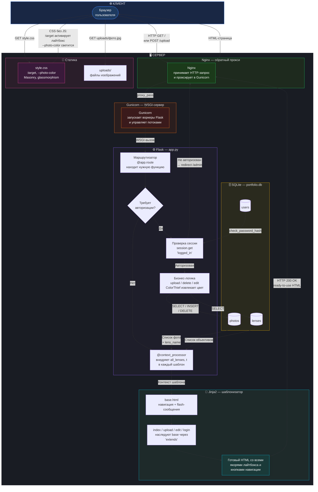

# 🎓 Разбор архитектуры проекта: Веб-портфолио фотографа

---

## 🗂️ ЧАСТЬ 0 — ВИЗУАЛИЗАЦИЯ АРХИТЕКТУРЫ

### Структура файлов и папок

```
ИТОГОВЫЙ ПРОЕКТ АЛГОРИТМИКА/
│
├── app.py                  ← 🧠 МОЗГ ПРИЛОЖЕНИЯ
│                              Все маршруты Flask, логика авторизации,
│                              загрузка фото, ColorThief, работа с БД
│
├── init_db.py              ← 🏗️ СТРОИТЕЛЬ БАЗЫ ДАННЫХ
│                              Запускается один раз. Создаёт таблицы
│                              users / lenses / photos, добавляет
│                              объективы и хэшированный пароль админа
│
├── portfolio.db             ← 🗄️ БАЗА ДАННЫХ (SQLite)
│                              Один файл — вся база. Хранит фото,
│                              объективы и учётные данные администратора
│
├── requirements.txt         ← 📦 СПИСОК ЗАВИСИМОСТЕЙ
│                              Flask, Werkzeug, ColorThief, Pillow —
│                              всё что нужно для pip install
│
├── templates/               ← 🎨 HTML-ШАБЛОНЫ (Jinja2)
│   │
│   ├── base.html            ← 🏛️ МАСТЕР-ШАБЛОН
│   │                          Шапка, навигация, подвал, flash-сообщения.
│   │                          Все остальные шаблоны наследуют от него
│   │                          через 
│   │
│   ├── index.html           ← 🖼️ ГЛАВНАЯ ГАЛЕРЕЯ
│   │                          Masonry-сетка карточек. Лайтбокс с
│   │                          циклической навигацией через :target.
│   │                          Алгоритм loop.first / loop.last / loop.index0
│   │
│   ├── login.html           ← 🔐 ФОРМА ВХОДА (скрытая, /admin)
│   │                          Простая форма авторизации. POST-запрос
│   │                          проверяет хэш пароля через Werkzeug
│   │
│   ├── upload.html          ← ⬆️ ФОРМА ЗАГРУЗКИ ФОТО
│   │                          Выбор файла, название, описание,
│   │                          выпадающий список объективов из БД
│   │
│   └── edit.html            ← ✏️ ФОРМА РЕДАКТИРОВАНИЯ ФОТО
│                              Превью текущего фото, цветной бейдж
│                              dominant_color, изменение метаданных
│
└── static/                  ← 📁 СТАТИЧЕСКИЕ ФАЙЛЫ
    │
    ├── style.css             ← 💅 ВСЯ СТИЛИЗАЦИЯ + ИНТЕРАКТИВНОСТЬ
    │                           CSS-переменные, Masonry-сетка,
    │                           glassmorphism-лайтбокс, :target-магия,
    │                           динамическое свечение --photo-color,
    │                           адаптивность для мобильных (768px)
    │
    └── uploads/              ← 🖼️ ХРАНИЛИЩЕ ЗАГРУЖЕННЫХ ФОТО
                                Реальные файлы изображений на диске.
                                Имена — UUID-префикс + оригинальное имя
                                (например: a3f91b2c_закат.jpg)
```

---

### Блок-схема полного цикла запрос → ответ



> [!TIP]
> **Как читать схему:** следи за стрелками сверху вниз. Браузер → Nginx → Gunicorn → Flask → SQLite → Jinja2 → HTML → обратно в браузер. Статика (CSS, картинки) запрашивается отдельно и отдаётся напрямую Nginx.

> [!NOTE]
> **На локальной разработке** (у тебя сейчас) Nginx и Gunicorn отсутствуют — Flask запускается напрямую через `app.run()`. На боевом сервере (VPS/продакшн) добавляются Nginx как обратный прокси и Gunicorn как WSGI-сервер для надёжности и производительности.

> Читай это как конспект перед защитой. Здесь всё по твоему реальному коду.

---

## ЧАСТЬ 1 — АНАТОМИЯ ПРОЕКТА

### 🔗 1.1 Как работает связка клиент-сервер

Представь, что браузер — это посетитель ресторана, а Flask — повар на кухне.

**Что происходит, когда пользователь заходит на главную страницу:**

```
Браузер          →      Flask (app.py)       →      SQLite (portfolio.db)
GET /            →      def index():         →      SELECT photos.*, lenses.name ...
                 ←      render_template()    ←      [список фото из БД]
HTML-страница    ←      Jinja2 рендерит HTML
```

**Шаг за шагом по коду:**

1. Пользователь вводит адрес сайта → браузер отправляет **HTTP GET-запрос** на `/`
2. Flask находит маршрут `@app.route('/')` и вызывает функцию `index()`
3. Внутри `index()` открывается соединение с базой данных через `get_db_connection()`
4. Выполняется SQL-запрос с `JOIN` — он соединяет таблицы `photos` и `lenses`, чтобы к каждому фото подтянуть название объектива:
   ```sql
   SELECT photos.*, lenses.name as lens_name
   FROM photos
   JOIN lenses ON photos.lens_id = lenses.id
   ORDER BY photos.id DESC
   ```
5. Flask передаёт список фото в шаблон `index.html` через `render_template('index.html', photos=photos)`
6. **Jinja2** (движок шаблонов) обходит список `photos` в цикле `` и генерирует HTML для каждой карточки
7. Готовый HTML-файл отправляется браузеру — пользователь видит галерею

> **Ключевая мысль для защиты:** сервер генерирует HTML полностью — браузер получает уже готовую страницу. Это называется **серверный рендеринг** (SSR — Server-Side Rendering). Никакого JavaScript для этого не нужно.

---

### 🗄️ 1.2 Как работает база данных

**`init_db.py` — это скрипт первого запуска.** Его задача — создать чистую структуру базы данных. Запускается один раз.

**Три таблицы в базе:**

| Таблица | Зачем |
|---|---|
| `users` | Хранит логин и **хэш пароля** администратора (не сам пароль!) |
| `lenses` | Справочник объективов (Canon EF 50, Helios 44-2 и др.) |
| `photos` | Все фотографии: название, файл, описание, ссылка на объектив, **dominant_color** |

**Связь между таблицами — FOREIGN KEY:**
```
photos.lens_id → lenses.id
```
Фото не хранит название объектива текстом — оно хранит только его `id`. Название берётся JOIN-запросом. Это называется **нормализация базы данных** — принцип, исключающий дублирование данных.

**Безопасность паролей — хэширование:**
```python
# init_db.py, строка 46
admin_password = generate_password_hash("S19072010s+")
```
В базу записывается не сам пароль, а его **необратимый хэш** через алгоритм PBKDF2. Даже если кто-то украдёт базу данных — пароль он не узнает. При входе Werkzeug сравнивает хэши:
```python
# app.py, строка 217
if user and check_password_hash(user['password_hash'], password):
```

**Полный цикл загрузки фото (маршрут `/upload`):**

```
1. Пользователь отправляет форму (POST /upload)
2. Flask проверяет сессию: session.get('logged_in') — защита маршрута
3. Файл сохраняется на диск в static/uploads/ с UUID-префиксом:
   unique_filename = f"{uuid.uuid4().hex[:8]}_{filename}"
4. ColorThief анализирует файл и извлекает доминирующий цвет:
   dominant_color = extract_dominant_color(file_path)   → '#eab308'
5. В БД записывается строка:
   INSERT INTO photos (title, filename, description, lens_id, dominant_color)
   VALUES (?, ?, ?, ?, ?)
6. Редирект на главную страницу — пользователь видит новое фото
```

> **UUID-префикс** нужен, чтобы два файла с одинаковым именем `photo.jpg` не перезаписывали друг друга. Первые 8 символов UUID дают 4 млрд уникальных комбинаций.

---

### 🎯 1.3 Самая сложная часть: лайтбокс БЕЗ JavaScript

Это главная техническая фишка проекта. Объясняю пошагово.

#### Как обычно делают лайтбокс (с JS):
```javascript
// Так делают все. Нажал — JavaScript открыл модалку.
photo.addEventListener('click', () => {
    modal.style.display = 'flex';
});
```

#### Как это сделано в твоём проекте (без JS):

**Шаг 1 — Псевдокласс `:target` в CSS**

В CSS есть встроенный механизм: когда URL страницы содержит `#якорь`, CSS применяет стиль `:target` к элементу с этим `id`.

```css
/* style.css, строка 515 */
.lightbox-overlay {
    opacity: 0;          /* по умолчанию — невидим */
    visibility: hidden;
}

.lightbox-overlay:target {
    opacity: 1;          /* когда URL = #lightbox-3 — становится видимым */
    visibility: visible;
}
```

**Шаг 2 — Jinja2 генерирует якорные ссылки**

Для каждого фото создаётся уникальный `id` и ссылка на него:

```html
<!-- Карточка фото: клик меняет URL на #lightbox-5 -->
<a href="#lightbox-{{ photo.id }}">
    <div class="photo-card">...</div>
</a>

<!-- Модальное окно с тем же id -->
<div id="lightbox-{{ photo.id }}" class="lightbox-overlay">
    ...
</div>
```

Когда пользователь кликает по карточке — браузер добавляет `#lightbox-5` в URL. CSS видит это и применяет `:target` — модальное окно появляется. **Никакого JS.**

**Шаг 3 — Алгоритм циклической навигации на Jinja2**

Это самая умная часть. Jinja2 знает о каждом фото его позицию в списке через переменные цикла:

| Переменная | Что означает |
|---|---|
| `loop.index0` | Индекс текущего фото (с нуля): 0, 1, 2, 3... |
| `loop.first` | `True` если это первое фото в списке |
| `loop.last` | `True` если это последнее фото в списке |

**Логика стрелки «Назад»:**
```html

    <!-- Первое фото → прыгаем на ПОСЛЕДНЕЕ (цикличность) -->
    <a href="#lightbox-{{ photos[-1].id }}">‹</a>

    <!-- Иначе → просто предыдущее по индексу -->
    <a href="#lightbox-{{ photos[loop.index0 - 1].id }}">‹</a>

```

**Логика стрелки «Вперёд»:**
```html

    <!-- Последнее фото → прыгаем на ПЕРВОЕ (цикличность) -->
    <a href="#lightbox-{{ photos[0].id }}">›</a>

    <!-- Иначе → просто следующее по индексу -->
    <a href="#lightbox-{{ photos[loop.index0 + 1].id }}">›</a>

```

**Пример с 4 фото (id: 10, 11, 12, 13):**

```
Фото #10 (первое):  ← ведёт на #lightbox-13  |  → ведёт на #lightbox-11
Фото #11:           ← ведёт на #lightbox-10  |  → ведёт на #lightbox-12
Фото #12:           ← ведёт на #lightbox-11  |  → ведёт на #lightbox-13
Фото #13 (последнее): ← ведёт на #lightbox-12  |  → ведёт на #lightbox-10
```

Все ссылки прописываются **заранее на сервере** при генерации HTML. Браузер только меняет `#якорь` в URL — и CSS делает всё остальное.

---

### 🎨 1.4 ColorThief — компьютерное зрение

ColorThief — библиотека машинного обучения для извлечения цветов из изображений.

**Алгоритм k-medians:**
1. Изображение разбивается на тысячи пикселей
2. Алгоритм кластеризует их по цвету (как группировка похожих точек)
3. Возвращает центр самого большого кластера — это и есть доминирующий цвет

```python
# app.py, строка 46-49
color_thief = ColorThief(file_path)
rgb = color_thief.get_color(quality=5)
# (234, 179, 8)  →  '#eab308'
return '#{:02x}{:02x}{:02x}'.format(rgb[0], rgb[1], rgb[2])
```

**Как цвет используется в интерфейсе:**

Цвет передаётся в HTML через CSS-переменную в `inline`-стиле:
```html
<div class="photo-card" style="--photo-color: {{ photo.dominant_color }};">
```

И применяется в CSS для динамического свечения при наведении:
```css
/* style.css, строка 272-276 */
.photo-card:hover {
    box-shadow:
        0 0 20px 4px color-mix(in srgb, var(--photo-color) 55%, transparent),
        0 0  8px 2px color-mix(in srgb, var(--photo-color) 80%, transparent);
}
```

Каждая карточка светится своим уникальным цветом — автоматически, без ручной настройки.

---

## ЧАСТЬ 2 — СТРУКТУРА ПРЕЗЕНТАЦИИ

### 📊 Слайд 1 — Заголовок и цель проекта

**Заголовок:** «Динамическое веб-портфолио фотографа»

**Что говорить:**
- Я создал полноценное веб-приложение для хранения и демонстрации фотографий
- Стек: Python + Flask + SQLite + HTML/CSS
- Главная техническая фишка: **полный отказ от JavaScript** при реализации сложных интерфейсных элементов

**Показать:** живой сайт в браузере — открыть главную страницу с галереей

---

### 📊 Слайд 2 — Архитектура: как это всё работает

**Заголовок:** «Серверный рендеринг: Flask + Jinja2»

**Что говорить:**
- Приложение построено по архитектуре **клиент-сервер**
- Когда пользователь открывает сайт — браузер отправляет запрос, Flask обрабатывает его, достаёт данные из базы, генерирует HTML и отдаёт его браузеру
- Шаблонизатор Jinja2 позволяет встраивать Python-логику прямо в HTML

**Показать:** схема на слайде (браузер → Flask → SQLite → HTML), затем открыть `app.py` — маршрут `def index()` + SQL-запрос с JOIN

---

### 📊 Слайд 3 — База данных и безопасность

**Заголовок:** «SQLite без ORM: нормализация и хэширование паролей»

**Что говорить:**
- База содержит 3 таблицы: `users`, `lenses`, `photos`
- Таблицы связаны через **FOREIGN KEY** — это нормализация данных (без дублирования)
- Пароль администратора хранится не в открытом виде, а как **PBKDF2-хэш** — это стандарт безопасности
- Все SQL-запросы используют **параметрическую подстановку** (`?`) — защита от SQL-инъекций

**Показать:** `init_db.py` — структура таблиц + строка `generate_password_hash`. Показать `app.py` — маршрут `/upload`, цикл: сохранение файла → ColorThief → INSERT в БД

---

### 📊 Слайд 4 — Компьютерное зрение: ColorThief

**Заголовок:** «Алгоритм k-medians: автоматическое извлечение цвета»

**Что говорить:**
- При загрузке каждого фото запускается алгоритм кластеризации цветов (k-medians)
- Он анализирует все пиксели изображения и находит самый доминирующий цвет
- Цвет сохраняется в базе данных в формате HEX и используется для динамического свечения каждой карточки при наведении
- Это значит: каждое фото имеет свой уникальный «цветовой отпечаток»

**Показать:** навести мышь на несколько фото в галерее — каждое светится своим цветом. Затем показать `app.py` строки 37-53 (`extract_dominant_color`) и `style.css` строки 272-276 (`box-shadow` с `var(--photo-color)`)

---

### 📊 Слайд 5 — Главная фишка: лайтбокс без JavaScript

**Заголовок:** «CSS :target + Jinja2 = интерактивный лайтбокс без единой строки JS»

**Что говорить:**
- Обычно для модальных окон используют JavaScript. Я отказался от него полностью
- Вместо JS используется нативный CSS-псевдокласс `:target` — он активируется, когда URL содержит `#якорь`
- Jinja2 на сервере заранее прописывает все ссылки для навигации, включая циклическую: последнее фото → первое, первое фото → последнее
- Вся «магия» происходит на уровне URL браузера и CSS — без единой строки JavaScript

**Показать:**
1. Кликнуть по фото — открылся лайтбокс. Показать `#lightbox-N` в адресной строке браузера
2. Открыть DevTools → Elements, показать `id="lightbox-5"` и класс `.lightbox-overlay`
3. Показать `style.css` строки 514-518 — магический `:target`
4. Показать `index.html` строки 71-87 — алгоритм с `loop.first`, `loop.last`, `loop.index0`

---

### 📊 Слайд 6 — Итог и что я узнал

**Заголовок:** «Что я реализовал и чему научился»

**Что говорить:**
- Я написал полноценное веб-приложение с нуля: бэкенд, база данных, фронтенд
- Решил нетривиальную задачу нестандартным способом: интерактивный UI без JavaScript
- Реализовал безопасность: хэширование паролей, защита маршрутов, SQL-параметризация
- Применил компьютерное зрение для автоматической обработки изображений
- Добавил двуязычность (RU/EN) без сторонних библиотек — через словарь переводов

**Возможные вопросы преподавателя и ответы:**

| Вопрос | Ответ |
|---|---|
| Почему Flask, а не Django? | Flask — микрофреймворк, даёт полный контроль. Django — «батарейки включены», но скрывает детали реализации |
| Почему SQLite, а не PostgreSQL? | Для портфолио без нагрузки SQLite идеален: один файл, ноль настроек |
| Почему без ORM (без SQLAlchemy)? | Чистый SQL — я точно понимаю каждый запрос. ORM — удобство, но магия «под капотом» |
| А если JS отключён у пользователя? | Сайт работает полностью — в этом и смысл. Ни одна функция не зависит от JS |
| Как защищён маршрут загрузки? | `session.get('logged_in')` проверяется до любого действия. Нет сессии — редирект на /admin |
| Что такое SQL-инъекция? | Атака, когда пользователь вводит SQL-код в форму. Параметрическая подстановка `?` делает это невозможным |
